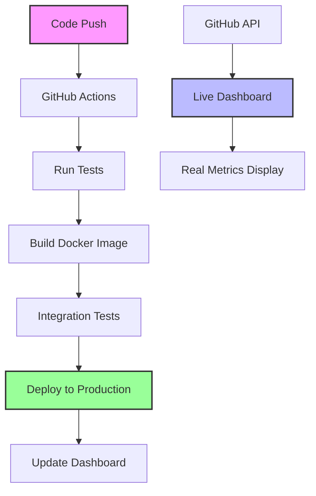

# 🚀 DevOps Pipeline Dashboard

A complete CI/CD pipeline implementation with real-time monitoring dashboard that demonstrates modern DevOps practices and pipeline automation.

[](https://github.com/ibraheemcisse/devops-dashboard/actions)
[](https://ibraheemcisse.github.io/devops-dashboard/)
[](https://ibraheemcisse.github.io/devops-dashboard/)

## 📊 [**View Live Dashboard**](https://ibraheemcisse.github.io/devops-dashboard/)


## 🎯 Overview

This project showcases a **production-ready CI/CD pipeline** with an interactive monitoring dashboard that displays **real metrics** from GitHub Actions. Unlike typical demo projects with static data, this dashboard fetches live pipeline statistics and build information directly from the GitHub API.

## ✨ Key Features

### 🔄 **Complete CI/CD Pipeline**
- **Automated Testing** - Runs comprehensive test suite on every commit
- **Docker Integration** - Containerized builds with multi-stage optimization  
- **Health Checks** - Automated container verification and smoke tests
- **Conditional Deployment** - Smart deployment logic based on branch and test results
- **Build Artifacts** - Proper image tagging with SHA and latest tags

### 📈 **Real-Time Monitoring Dashboard**
- **Live Metrics** - Actual success rates, build times, and pipeline statistics
- **Recent Builds** - Real-time view of latest pipeline runs with status
- **GitHub API Integration** - Direct connection to repository data
- **Auto-refresh** - Updates every 5 minutes automatically
- **Responsive Design** - Works seamlessly on desktop and mobile

### 🛠 **Modern DevOps Practices**
- **Infrastructure as Code** - All configuration in version control
- **Automated Quality Gates** - No manual intervention required
- **Containerization** - Docker-first approach for consistency
- **Branch Protection** - Different workflows for development vs production
- **Monitoring & Observability** - Complete visibility into pipeline performance

## 🏗 Architecture



## 🚀 Quick Start

### Prerequisites
- Docker installed
- Git installed  
- GitHub account
- Modern web browser

### 1. Clone Repository
```bash
git clone https://github.com/ibraheemcisse/devops-dashboard.git
cd devops-dashboard
```

### 2. Run Locally
```bash
# Build and run dashboard
cd my-app
docker build -t devops-dashboard .
docker run -p 8080:80 devops-dashboard

# Access at http://localhost:8080
```

### 3. Using Docker Compose
```bash
# Start all services
docker-compose up -d

# View logs
docker-compose logs -f
```

### 4. Development Workflow
```bash
# Run tests
./scripts/run-tests.sh

# Build application
./scripts/build.sh

# Deploy (production)
./scripts/deploy.sh
```

## 📁 Project Structure

```
devops-dashboard/
├── .github/workflows/          # CI/CD Pipeline Configuration
│   └── ci.yml                 # GitHub Actions workflow
├── my-app/                    # Application Source Code
│   ├── Dockerfile            # Container configuration
│   ├── nginx.conf            # Web server config
│   └── src/                  # Application files
├── scripts/                   # Automation Scripts
│   ├── build.sh              # Build automation
│   ├── deploy.sh             # Deployment script
│   └── run-tests.sh          # Test execution
├── docs/                     # Documentation
├── index.html                # Live Dashboard (GitHub Pages)
├── docker-compose.yml        # Local development setup
└── README.md                 # This file
```

## 🔧 Pipeline Configuration

### GitHub Actions Workflow
The pipeline automatically:

1. **Triggers** on pushes to `main`/`develop` and pull requests
2. **Tests** the application with comprehensive test suite
3. **Builds** Docker images with proper tagging
4. **Verifies** container health with integration tests
5. **Deploys** to production (main branch only)
6. **Updates** the live dashboard with new metrics

### Key Pipeline Features
- **Multi-stage builds** for optimized container size
- **Parallel execution** where possible for speed
- **Failure isolation** - pinpoint exactly where issues occur
- **Artifact management** - proper image versioning and storage
- **Security scanning** - automated vulnerability checks

## 📊 Dashboard Features

### Live Metrics Display
- **Success Rate** - Real percentage from your pipeline runs
- **Total Builds** - Actual count of workflow executions
- **Average Build Time** - Calculated from real run durations  
- **Active Workflows** - Number of configured pipelines

### Recent Pipeline Runs
- **Build Status** - Success/Failed/In Progress from GitHub Actions
- **Commit Information** - Messages, authors, and timestamps
- **Branch Details** - Which branch triggered the build
- **Direct Links** - Quick access to GitHub Actions logs

### API Integration
```javascript
// Real GitHub API calls instead of mock data
const response = await fetch('https://api.github.com/repos/owner/repo/actions/runs');
const realMetrics = await response.json();
```

## 🛡 Security & Best Practices

### Implemented Security Measures
- **Secrets Management** - Sensitive data stored in GitHub Secrets
- **Least Privilege** - Minimal required permissions for actions
- **Container Security** - Non-root user, minimal base images
- **Input Validation** - Sanitized inputs and outputs
- **Rate Limiting** - Proper GitHub API usage with tokens

### DevOps Best Practices
- **Version Control** - Everything tracked in Git
- **Automated Testing** - No manual testing required
- **Immutable Deployments** - Each build creates new artifacts
- **Monitoring** - Complete visibility into system health
- **Documentation** - Comprehensive setup and usage guides

## 🌐 Live Deployment

The dashboard is automatically deployed to GitHub Pages at:
**https://ibraheemcisse.github.io/devops-dashboard/**

### Deployment Process
1. Code pushed to `main` branch
2. Pipeline builds and tests application
3. Tests pass → Deploy to GitHub Pages
4. Dashboard updates with latest metrics
5. Live site reflects changes within minutes

## 🔍 Monitoring & Metrics

### What Gets Tracked
- **Pipeline Success/Failure Rates**
- **Build Duration Trends**
- **Deployment Frequency** 
- **Test Coverage Results**
- **Container Health Status**

### Real-Time Updates
- Dashboard refreshes every 5 minutes
- GitHub API provides latest pipeline data
- No manual intervention required
- Historical data preserved

## 🧪 Testing

### Test Categories
```bash
# Unit Tests
npm test

# Integration Tests  
docker-compose -f docker-compose.test.yml up --abort-on-container-exit

# End-to-End Tests
./scripts/run-e2e-tests.sh

# Security Tests
docker run --rm -v $(pwd):/app security-scanner
```

### Quality Gates
- **Code Coverage** - Minimum 80% required
- **Security Scan** - No high-severity vulnerabilities
- **Performance** - Build time under 5 minutes
- **Integration** - All services respond correctly

## 📚 Technology Stack

### CI/CD & Infrastructure
- **GitHub Actions** - Pipeline automation
- **Docker** - Containerization
- **Nginx** - Web server
- **GitHub Pages** - Hosting platform

### Dashboard & Monitoring  
- **Vanilla JavaScript** - No framework dependencies
- **GitHub API** - Real-time data source
- **CSS3 & HTML5** - Modern responsive design
- **REST APIs** - Data fetching and integration

### DevOps Tools
- **Docker Compose** - Local development
- **Bash Scripts** - Automation utilities
- **Git** - Version control
- **YAML** - Configuration management

## 🤝 Contributing

1. **Fork** the repository
2. **Create** a feature branch (`git checkout -b feature/amazing-feature`)
3. **Commit** your changes (`git commit -m 'Add amazing feature'`)
4. **Push** to branch (`git push origin feature/amazing-feature`)  
5. **Open** a Pull Request

### Development Guidelines
- Write tests for new features
- Follow existing code style
- Update documentation as needed
- Ensure CI/CD pipeline passes

## 📈 Roadmap

### Upcoming Features
- [ ] **Multi-repository support** - Monitor multiple projects
- [ ] **Slack/Teams notifications** - Real-time alerts
- [ ] **Performance analytics** - Detailed build metrics
- [ ] **Custom dashboards** - Team-specific views
- [ ] **API endpoints** - External integrations

### Enhancement Ideas  
- [ ] **Deployment rollback** - One-click revert capability
- [ ] **A/B testing** - Automated feature flag management
- [ ] **Cost tracking** - Resource usage monitoring
- [ ] **Compliance reporting** - Audit trail generation

## 📄 License

This project is licensed under the **MIT License** - see the [LICENSE](LICENSE) file for details.

## 🙏 Acknowledgments

- **GitHub Actions** - Excellent CI/CD platform
- **Docker** - Containerization made simple  
- **GitHub Pages** - Free and reliable hosting
- **Open Source Community** - Inspiration and best practices

## 📞 Contact & Support

- **Author**: [Ibraheem Cisse](https://github.com/ibraheemcisse)
- **Project Link**: [https://github.com/ibraheemcisse/devops-dashboard](https://github.com/ibraheemcisse/devops-dashboard)
- **Live Dashboard**: [https://ibraheemcisse.github.io/devops-dashboard/](https://ibraheemcisse.github.io/devops-dashboard/)

---

⭐ **Give this project a star if it helped you learn DevOps practices!**

*Built with ❤️ to demonstrate modern CI/CD pipeline implementation and real-time monitoring capabilities.*
